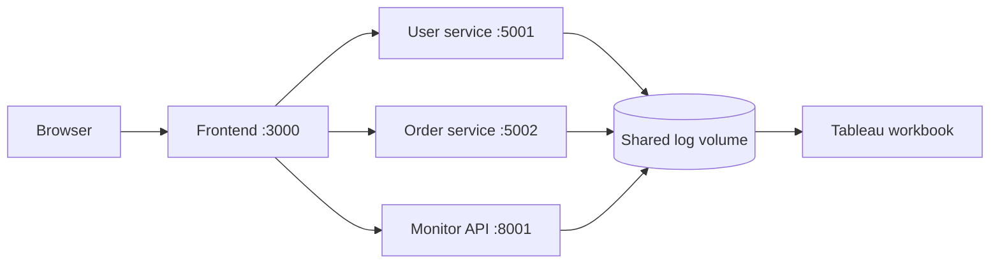

# Containerized Log Monitoring

A Docker Compose demo of two Flask services that write application logs to a shared volume, a monitoring API that reads them, and a browser dashboard. A Tableau workbook is included for exploring exported log data.

> This project demonstrates log collection and analysis. It does not currently include Prometheus, Grafana, or Node Exporter.

## Architecture



The frontend is served on port 3000. The user and order services are published on 5001 and 5002. The monitoring API listens on container port 8000 and is published on host port 8001. The services share the 'shared-logs' Docker volume.

## Run locally

Requirements: Docker Engine and the Docker Compose plugin.

```sh
docker compose up --build
```

Open [http://localhost:3000](http://localhost:3000). Stop with `docker compose down`.

## Scope

This project demonstrates a multi-container application, shared-volume log handling, health checks, a log-analysis API, and Tableau visualization. The dashboard is not a Prometheus/Grafana metrics stack.
